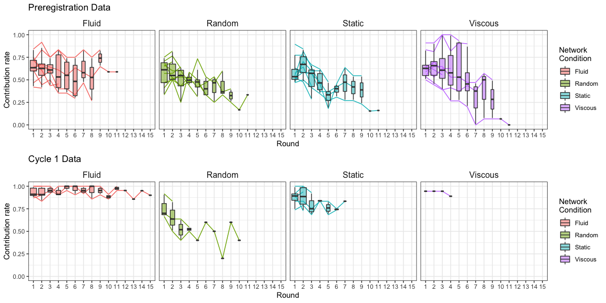
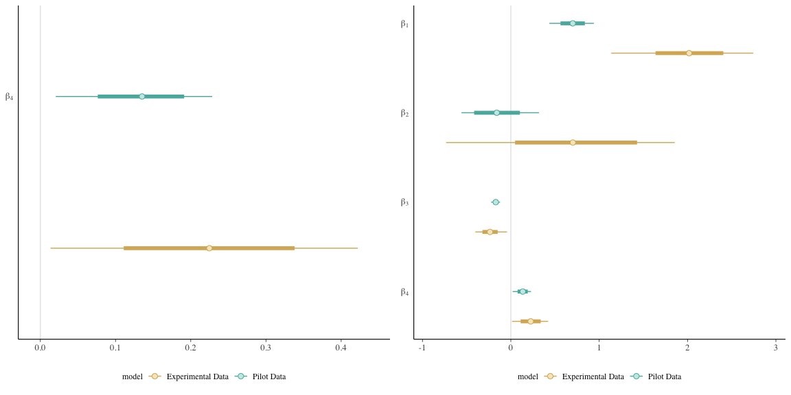
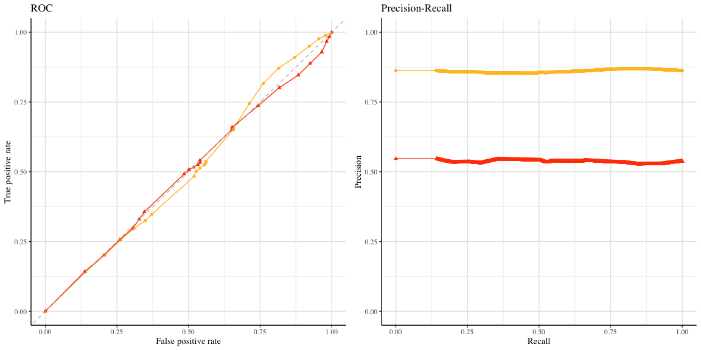
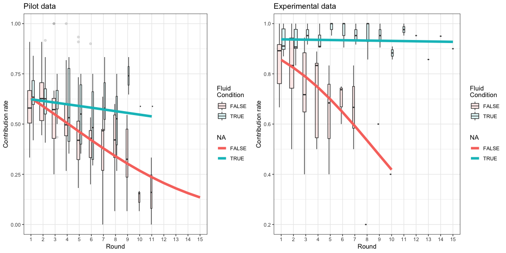
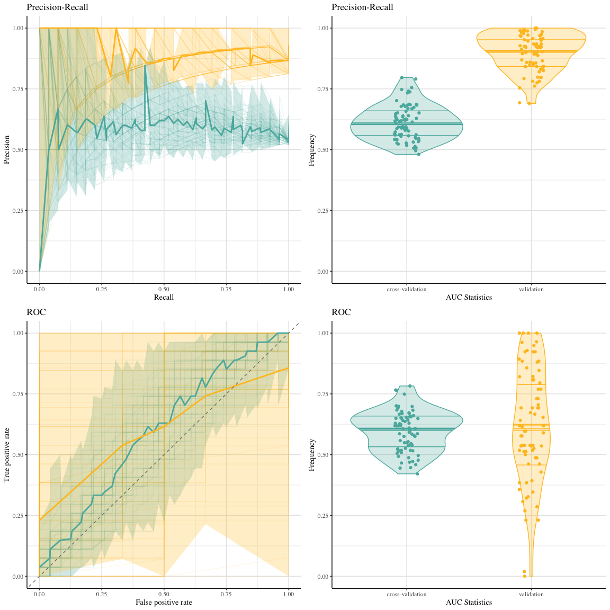
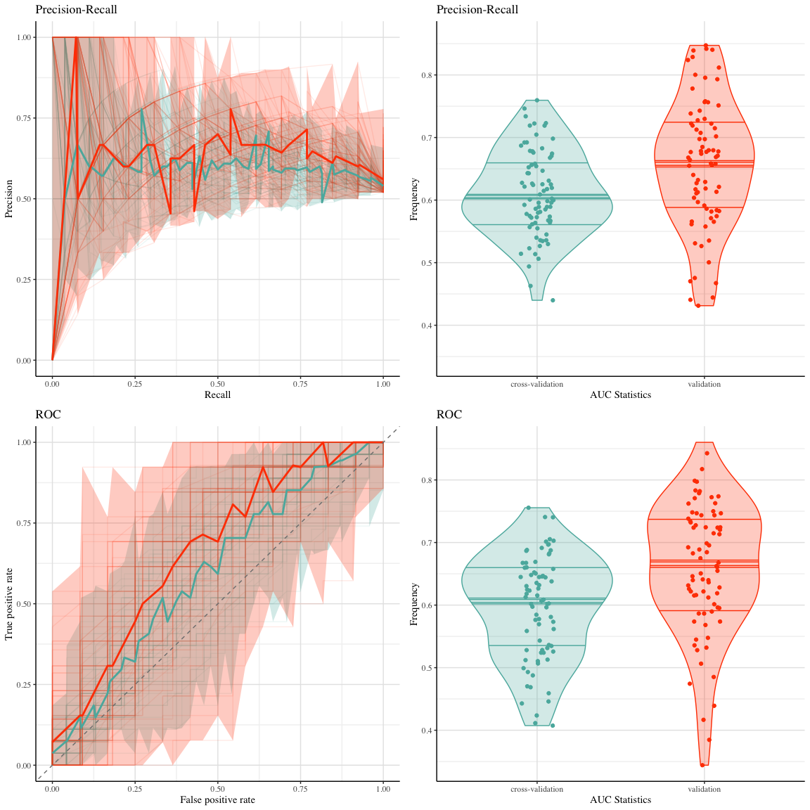

Prediction Scoring
================

This repository contains code to reproduce the figures and analysis in
the following paper:

-   Smith, Anna L., Zheng, Tian, and Gelman, Andrew. (*to appear*)
    “Prediction scoring of data-driven discoveries for reproducible
    research.” *Statistics and Computing.* doi: 10.7916/D82F95D0.

All code to reproduce the real data example is available in the
PredictionScoring.Rmd document (previews available below), and
accompanying helper .R files. The simulation study also uses the code in
the “predScore4_alter_102919.R” file, and additional code is available
on request.

# (Preview) Section 5: Preregistered hypotheses in human behavior experiments

## Download the data

The data is freely available at the following link:
<https://github.com/gal-zz-lup/NGS2>.

``` r
##  copy links for raw dataset files
gallup_coop <- url("https://raw.githubusercontent.com/gal-zz-lup/NGS2/master/cooperation_exp1_FINAL.csv")
gallup_rewire <- url("https://raw.githubusercontent.com/gal-zz-lup/NGS2/master/rewire_exp1.csv")
```

``` r
temp <- tempfile()
download.file("http://davidrand-cooperation.com/s/Rand2011PNAS_data_and_code-pi6b.zip",
              temp, mode="wb")
gallup1 <- read.table(unz(temp,"Rand2011PNAS_cooperation_data.txt"),
                      sep="\t",skip=0,header=T)
unlink(temp)

gallup2 <- read.csv(gallup_coop,header = TRUE,sep = ',')
```

Perform some data cleaning tasks, including making variable names match
and preparing round-level data.

## Exploratory plots

``` r
g.pre <- plotContr(gallup1rounds,title="Preregistration Data") 
g.cyc1 <- plotContr(gallup2rounds,title="Cycle 1 Data")

grid.arrange(g.pre,g.cyc1,nrow=2)
```

    ## Warning: Removed 4 rows containing non-finite values (stat_boxplot).

    ## Warning: Removed 4 row(s) containing missing values (geom_path).

<!-- -->

## Traditional analysis

``` r
hyp1.4 <- as.formula(decision..0.D.1.C. ~ fluid_dummy + round_num +
                       fluid_dummy*round_num)
## Model with preregistration data
model1.4 <- stan_glm( hyp1.4, data = gallup1,
                      family = binomial(link = "logit") )
model1.4_freq <- glm( hyp1.4, data=gallup1, family="binomial" )

## Model with Cycle 1 data
model2.4 <- stan_glm( hyp1.4, data = gallup2,
                      family = binomial(link = "logit") )
model2.4_freq <- glm( hyp1.4, data=gallup2, family="binomial" )
```

### Parameter estimates

    ##                 (Intercept) pval fluid_dummy   pval  round_num pval
    ## preregistration   0.7006399    0  -0.1595399 0.2200 -0.1704060    0
    ## cycle 1           2.0178042    0   0.7020062 0.0401 -0.2355459    0
    ##                 fluid_dummy:round_num  pval    n
    ## preregistration             0.1352611 0e+00 3876
    ## cycle 1                     0.2247957 1e-04 1192

<!-- -->

### ROC and Precision-Recall Curves

<!-- -->

### Model estimates and observed data

    ## Warning: Removed 4 rows containing non-finite values (stat_boxplot).

<!-- -->

## Prediction Scoring

Each of the following versions of our prediction scoring method takes \~
10 minutes to run.

### Unweighted version

``` r
set.seed(myseed)
val_1.4 <- predscore( model1.4, newdata=gallup2, Ksize=50 )
```

    ## Warning: Removed 3 rows containing missing values (geom_point).

<!-- -->

``` r
ks.test( val_1.4$cv$results$q, val_1.4$val$results$q )
```

    ## 
    ##  Exact two-sample Kolmogorov-Smirnov test
    ## 
    ## data:  val_1.4$cv$results$q and val_1.4$val$results$q
    ## D = 0.93506, p-value = 8.993e-14
    ## alternative hypothesis: two-sided

### Weighted version

Observations are resampled to match the marginal distributions.

``` r
set.seed(myseed)
val_wtd_1.4 <- predscore( model1.4, newdata=gallup2, Ksize=50,
                      wtd=TRUE )
```

    ## Warning: Removed 1 rows containing missing values (geom_point).

<!-- -->

``` r
ks.test( val_wtd_1.4$cv$results$q, val_wtd_1.4$val$results$q )
```

    ## 
    ##  Exact two-sample Kolmogorov-Smirnov test
    ## 
    ## data:  val_wtd_1.4$cv$results$q and val_wtd_1.4$val$results$q
    ## D = 0.2987, p-value = 0.001957
    ## alternative hypothesis: two-sided
